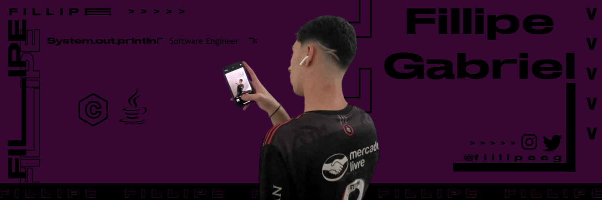

  

----- 

  
  
  
  
  

  <i><b>Olá</b> :wave:, sou o <code>Fillipe</code>, tenho 18 anos, moro em BH e faço engenharia de software na 
  <a href="https://www.pucminas.br/">PUC Minas</a>.</i>

----- 

<h2 align="center">Sobre mim:</h2>

  
Meu nome é <b>Fillipe Gabriel</b>. Nasci em Ipatinga, mas atualmente moro em Belo Horizonte e curso <b>Engenharia de Software</b> na <b>PUC Minas do Coreu</b>.

  
  
Fiz praticamente todos os meus anos escolares no <b>Colégio Tiradentes da Polícia Militar</b>.

  
  
Falo inglês fluentemente e já morei nos <b>Estados Unidos por 1 ano</b>, onde fiz o ensino médio na <b>Cape Coral Highschool</b>, aprimorando minhas habilidades no idioma.

