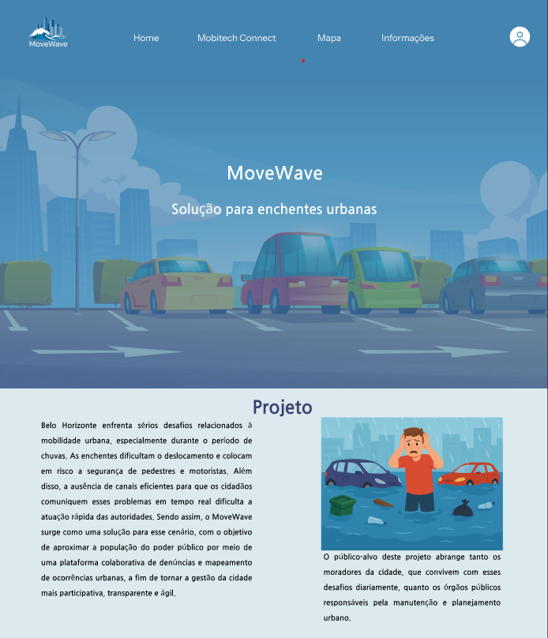
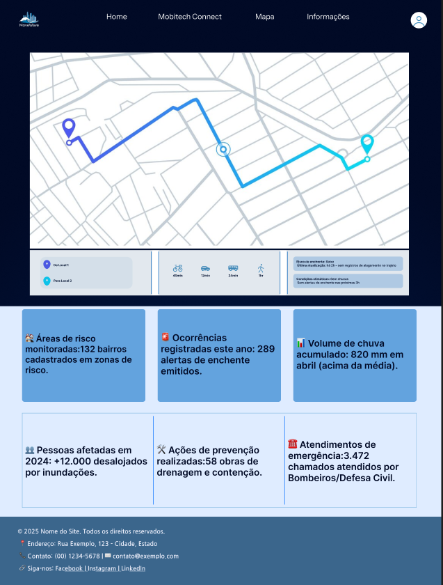
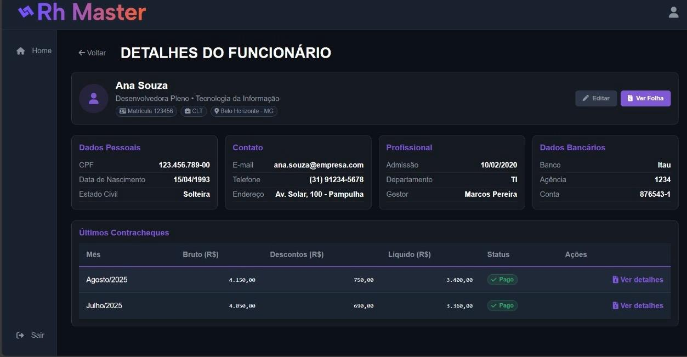

  

----- 

<table align="center" cellpadding="0" cellspacing="0" style="border-collapse: collapse;">
  <tr>
    <td align="center" style="padding: 0 15px;">
      
    </td>
    <td align="center" style="padding: 0 15px; border-left: 2px solid #cccccc;">
      
    </td>
    <td align="center" style="padding: 0 15px; border-left: 2px solid #cccccc;">
      
    </td>
    <td align="center" style="padding: 0 15px; border-left: 2px solid #cccccc;">
      
    </td>
    <td align="center" style="padding: 0 15px; border-left: 2px solid #cccccc;">
      
    </td>
  </tr>
</table>

<h2 align="center">Sobre mim:</h2>

  
Meu nome é <b>Fillipe Gabriel</b>. Nasci em Ipatinga, mas atualmente moro em Belo Horizonte e curso <b>Engenharia de Software</b> na <b>PUC Minas do Coreu</b>.

  
  
Fiz praticamente todos os meus anos escolares no <b>Colégio Tiradentes da Polícia Militar</b>.

  
  
Falo inglês fluentemente e já morei nos <b>Estados Unidos por 1 ano</b>, onde fiz o ensino médio na <b>Cape Coral Highschool</b>, aprimorando minhas habilidades no idioma.

  
Tenho grande interesse em compreender a lógica por trás dos sistemas e em construir soluções eficientes, bem estruturadas e que realmente façam diferença.
  Ao longo da minha trajetória, fui construindo um perfil marcado pela curiosidade e pelo desejo constante de evolução. Gosto de entender o “porquê” das coisas, de analisar problemas com calma e buscar soluções que façam sentido na prática. Tenho facilidade em aprender novas tecnologias, compreender conceitos complexos e me adaptar a diferentes situações. 

----- 

Idiomas:
- Português (nativo)
- Inglês (avançado)

----- 

  

----- 

## 🚀 Projetos

### 🌊 MoveWave

- Desenvolvimento de site para prevenção de enchentes em BH.
- Funcionalidades: alertas, rotas alternativas, avisos emergenciais e dicas de prevenção.
- Experiência em desenvolvimento web com foco em impacto social.

  
  

🔗 [Acessar o repositório do MoveWave](https://github.com/ICEI-PUC-Minas-PMGES-TI/pmg-es-2025-1-ti1-2010200-mobitech-urban.git)

### ❤️ CanDonate *(Em desenvolvimento)*
- Sistema de doação para facilitar contribuições.
- Funcionalidades previstas: cadastro de doadores, cadastro de doações, sistema de avaliação e cadastro de beneficiários.
- Experiência em desenvolvimento de sistemas com foco social.

### 👔 RH Master
- Sistema de gerenciamento de funcionários.
- Funcionalidades: controle de funcionários, folhas de pagamento, cálculo de impostos e relatórios.
- Experiência em desenvolvimento de sistemas corporativos com regras de negócio complexas.

  

🔗 [Acessar o repositório do RH Master](https://github.com/ICEI-PUC-Minas-EngSoft-PM/tp-rhsoft-rh-master)

-----

## 📊 GitHub Stats

-----

----- 

## 🛠️ Skills:

### 💻 Hard Skills

  
  
  
  
  
  
  
  
  
  
  
  
  
  
  
 
  
  
  
  
  
  

### 🤝 Soft Skills
- Liderança
- Comunicativo   
- Trabalho em equipe  
- Respeito   
- Organização   
- Resolução de problemas   
- Adaptabilidade 

-----

## ⚡ Principais Linguagens

  
  
  

-----

 Fillipe's Spotify Data

<table>
<tr>
 <td align="center" colspan="3"></td>
</tr> 
<tr>
<td>

</td>
<td>

</td>
<td>
<!--  -->

</td>
</tr>
<tr>
 <td align="center" colspan="3"></td>
</tr> 
</table>

