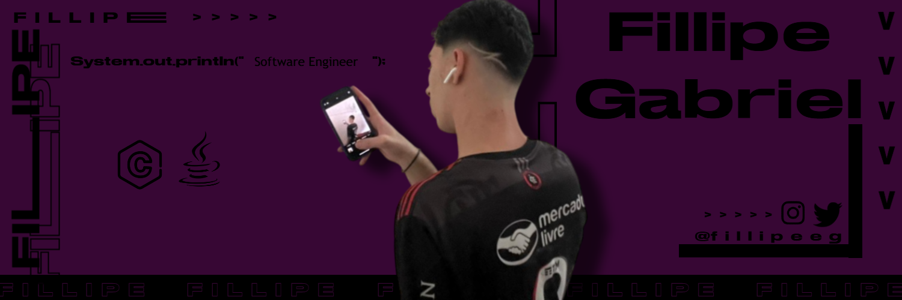

  

----- 

  
  
  
  
  
  
  
  
  
  
  
  
  

----- 

<h2 align="center">Sobre mim:</h2>

  
Meu nome é <b>Fillipe Gabriel</b>. Nasci em Ipatinga, mas atualmente moro em Belo Horizonte e curso <b>Engenharia de Software</b> na <b>PUC Minas do Coreu</b>.

  
  
Fiz praticamente todos os meus anos escolares no <b>Colégio Tiradentes da Polícia Militar</b>.

  
  
Falo inglês fluentemente e já morei nos <b>Estados Unidos por 1 ano</b>, onde fiz o ensino médio na <b>Cape Coral Highschool</b>, aprimorando minhas habilidades no idioma.

----- 

Idiomas:
- Português (nativo)
- Inglês (fluente)

----- 

  

----- 

## 🚀 Projetos

### 🖥️ Projeto Extensionista de Introdução à Computação
- Lecionei programação básica para alunos do 9º ano.
- Ensinei variáveis, tipos de dados.
- Experiência em comunicação de conceitos técnicos para iniciantes.

### 🌊 MoveWave
- Desenvolvimento de site para prevenção de enchentes em BH.
- Funcionalidades: alertas, rotas alternativas, avisos emergenciais e dicas de prevenção.
- Experiência em desenvolvimento web com foco em impacto social.

> 🔜 Novos projetos serão adicionados em breve!

-----

## 📊 GitHub Stats

-----

----- 

## 🛠️ Skills:

### 💻 Hard Skills

### 🤝 Soft Skills
- Comunicativo 🗣️  
- Trabalho em equipe 👥  
- Respeito 🙌  
- Organização 📂  
- Resolução de problemas 🧩  
- Adaptabilidade 🔄  

-----

## ⚡ Principais Linguagens

  
  
  

-----

 Fillipe's Spotify Data

<table>
<tr>
 <td align="center" colspan="3"></td>
</tr> 
<tr>
<td>

</td>
<td>

</td>
<td>
<!--  -->

</td>
</tr>
<tr>
 <td align="center" colspan="3"></td>
</tr> 
</table>

